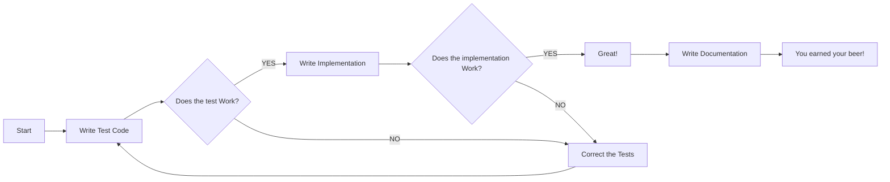
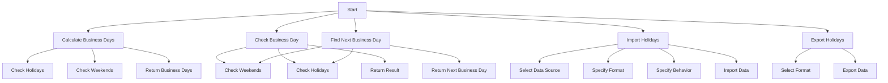
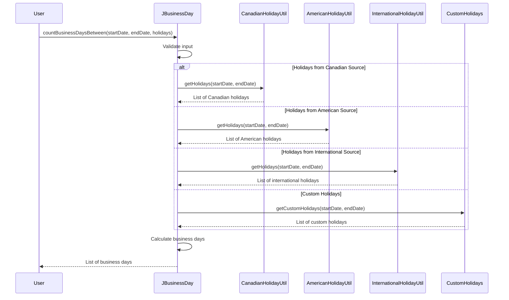

# JBusinessDay

## Table of Contents

- [1. Introduction](#1-introduction)
- [2. Background](#2-background)
- [3. Features](#3-features)
- [4. Architecture](#4-architecture)
- [5. Technologies Used](#5-technologies-used)
- [6. Implementation Details](#6-implementation-details)
- [7. Integration](#7-integration)
- [8. Performance and Optimization](#8-performance-and-optimization)
- [9. Documentation](#9-documentation)
- [10. Testing and Quality Assurance](#10-testing-and-quality-assurance)
- [11. Security and Privacy](#11-security-and-privacy)
- [12. Future Development](#12-future-development)
- [13. Conclusion](#13-conclusion)
- [14. Acknowledgments](#14-acknowledgments)
- [15. References](#15-references)
- [16. Appendices](#16-appendices)
- [17. Examples](#17-examples)
  - [Canada](#canada)
  - [U.S.A.](#usa)
  - [Custom](#custom)

## Author
  **Jean-Francois Landreville**
  [Mail](mailto:landrevillejf@protonmail.com)
  **Website:** [Lanaforge](https://lanaforge.ca)

## Version
**Current Version: 1.0.0-SNAPSHOT**

## Abstract
JBusinessDay is a Java library meticulously crafted to simplify the intricate task of managing business days, weekends, and holidays using the versatile java.time API. It addresses the critical need for precise and efficient date and time calculations in a range of software applications.

With today's demanding scheduling, financial, and various other applications, handling business days becomes crucial. The challenges arise when dealing with weekends, holidays, and ensuring accurate date calculations, as manual implementation can lead to redundancy, errors, and inefficiency. JBusinessDay, born out of the necessity for a dedicated solution, simplifies these complexities and offers a comprehensive, user-friendly toolkit for date and time operations within the business context.

This library distinguishes itself with a singular focus on managing business days and holidays. It aims to be the go-to solution for applications that require precision and ease in business day calculations. JBusinessDay offers a comprehensive suite of features and methods to enable developers to effortlessly manage these calculations, providing a valuable addition to the Java development ecosystem.

By combining the power of Java 17 compliance, the java.time API, modular architecture, and the Easter Computus Algorithm for holiday calculation, JBusinessDay is well-equipped to deliver efficient and precise business day management. It aligns with Java's standard date and time handling while facilitating robust and maintainable solutions. As the need for dependable date and time calculations continues to grow, JBusinessDay stands as a pillar for developers, simplifying complex date and time operations with precision and reliability.


## 1. Introduction

- JBusinessDay is a Java library that provides methods for working with business days, weekends, and holidays using the `java.time` API.
- Dealing with business day and non business day can be tricky so I wanted to create a java library to handle those operations easily.

## 2. Background
**Context:** JBusinessDay was born out of the need to address challenges related to working with date and time calculations in various software applications that use the Java programming language. Handling business days, weekends, and holidays is crucial in applications such as scheduling, financial software, and many others. These applications require precise and efficient date and time calculations, which can be complex and error-prone when done manually.

**Need:** The JBusinessDay library is designed to streamline the process of working with business days, weekends, and holidays using the java.time API. The need for this library arises from the difficulties developers face when calculating business days, accounting for holidays, and ensuring accurate date calculations. Without a dedicated library, developers often need to implement these features from scratch, leading to redundant code, potential errors, and inefficiencies. JBusinessDay addresses these challenges by providing a comprehensive and user-friendly solution for date and time calculations in a business context.

**Related Work:** While there are some existing solutions and libraries for date and time calculations in Java, JBusinessDay distinguishes itself by its specific focus on business days, weekends, and holidays. This library is tailored to meet the requirements of applications that rely on precise and efficient business day calculations. JBusinessDay provides a comprehensive set of features and methods to ensure developers can handle these calculations with ease and accuracy, making it a valuable addition to the Java ecosystem.

## 3. Features
- Flexible and easy-to-use methods for handling date calculations.
- User-Defined Holidays: the ability for users to define their own custom holiday rules. This feature allow developers to account for specific holidays that are not included in standard holiday lists.

### JBusinessDay Methods:
- `countBusinessDaysBetween`: Calculates a list of business days between a given start date and end date, excluding weekends and specified holidays.
- `isBusinessDay`: Return true if the day is a business day.
- `getNextBusinessDay`: Return the next business day.
- `ImportHolidays`: Import holidays from CSV, JSON, YAML, Excel, XML files using the `HolidayImporterUtil` and from the most commonly used databases, see `SupportedFormat` enum.
- `ExportHolidays`: Export holidays to CSV, JSON, YAML, Excel, XML files using the `HolidayExporterUtil`and to the most commonly used databases, see `SupportedFormat` enum..
- `addBusinessDays`: Adds a specified number of business days to the given date, skipping weekends and holidays.
- `subtractBusinessDays`: Subtracts a specified number of business days from the given date, skipping weekends and holidays.
- `isWeekend`: Checks if a given date falls on a weekend day.

### Other Utils: 
- `CanadianHolidayUtil`, Utility class for dealing with predefined Canadian Federal holidays observed across the 13 Canadian provinces and territories and their specifics holidays observances.
- `AmericanHolidayUtil`, Utility class for dealing with predefined American Federal holidays observed across the 50 American states and their specifics holidays observances. This class also feature a method: `isElectionYear(year)` that check if the year supplied is an election year in the U.S.A. `Inauguration Day (January 20, every 4 years following a presidential election)`
- `EasterUtil`, Utility class for calculating Easter and related holidays: Good Friday and Easter Monday. Edge cases: ***Earliest year supported 1583*** and ***latest year supported 4099***.
- `FloatingHolidayUtil`, Utility class for calculating floating holidays. eg: `Thanksgiving Day (The fourth Thursday in November)` in the U.S.A. , `Martin Luther King Jr. Day (The third Monday in January)`
- `InternationalizationUtility`, Utility class for internationalization and localization support in JBusinessDay.
## 4. Architecture
**High-Level Architecture:** JBusinessDay follows a modular architecture that consists of several key components. The library is organized into modules for business day calculations, date handling, and holiday computation. Each module is designed to perform specific tasks, making the library highly modular and extensible.

**Major Components:** The major components of JBusinessDay include:

- **JBusinessDay:** This core component handles the calculation of business days and provides methods to determine if a specific date is a business day. It also calculates the next business day.
- **Date Handling:** This module is responsible for parsing and formatting dates, ensuring consistency and compatibility with the java.time API.
- **Holiday Computation:** JBusinessDay uses the Easter Computus Algorithm for holiday calculation, which allows it to accurately determine holidays based on date ranges.

**Interactions:** These components interact seamlessly to provide a holistic solution for working with business days, weekends, and holidays. The BusinessDayCalculator relies on the Date Handling and Holiday Computation modules to accurately calculate business days, accounting for holidays and weekends. This modular design ensures code reusability and maintainability.

**Design Patterns:** JBusinessDay leverages the Strategy Pattern for handling different holiday calculation strategies. This pattern enables the library to support various regions and their specific holiday rules efficiently (13 Canadian provinces and territories & 50 U.S.A. states).

**Architectural Decisions:** The choice of Java 17 compliance ensures that JBusinessDay benefits from the latest Java features while maintaining compatibility with modern Java applications. The use of the java.time API aligns the library with Java's standard date and time handling, providing consistency and familiarity to Java developers. Additionally, the incorporation of SLF4J for logging allows for flexible and customizable logging options to assist with debugging and monitoring.

By adhering to these architectural decisions and design patterns, JBusinessDay offers a robust and maintainable solution for precise business day calculations, simplifying complex date and time operations in Java applications.

## 5. Technologies Used

- Java 17 compliant
- `java.time` API
- SLF4J for logging
- [Cucumber Framework](https://cucumber.io) is used for BDD testing (Behavior-driven development)

## 6. Implementation Details

- JavaTime concepts introduced in Java 9 are applied in the library.
- It uses the [Easter Computus Algorithm](https://en.wikipedia.org/wiki/Date_of_Easter)
- Address any challenges faced during implementation : state specific holidays and observances in the U.S.A.

## 7. Integration

- To use the `JBusinessDay` utility class, you need to include it in your Java project.
- The library is available on MavenCentral you can import it into your maven or gradle project, `io.github.landrevillejf.jbusinessday`, or download it via the [Lanaforge Website](https://lanaforge.ca) and add the jar file to your project's classpath.
- You can then call its methods to perform various date calculations. This class is especially useful for applications that need to work with business days, such as scheduling or financial software.

#### Holiday Import and Export

- Users of JBusinessDay have the capability to import holiday data from external sources. This simplifies the process of updating holiday lists to stay current with evolving holiday rules.

**Holiday Data Import:**

- You can import holiday data from external sources into JBusinessDay using the provided import functionality. This feature allows you to stay up-to-date with changing holiday rules and ensures that your library is aware of the latest holidays.

Key features of the holiday data import functionality include:

- Support for multiple data formats, including CSV, JSON, XML, and more.
- Flexible source options, enabling users to import data from local files, URLs, or databases.
- Data validation to ensure the imported data adheres to required structures.
- Options for merging imported data with existing holiday data or replacing it.
- User-friendly interfaces for initiating and configuring the import process.
- Robust error handling and detailed error messages for unsuccessful imports.
- Logging and notifications to keep users informed about import activities.

**Holiday Data Export:**

Additionally, JBusinessDay provides the capability to export holiday data to external sources, allowing you to share or back up your holiday lists.

The holiday import and export functionality empowers users to maintain accurate and up-to-date holiday data effortlessly.

[Learn more about importing holiday data](link_to_import_docs).
## 8. Performance and Optimization

### Performance Considerations

In the development of JBusinessDay, significant attention has been given to optimizing performance. The library is designed to execute business day calculations efficiently, making it suitable for real-time applications and large-scale systems.

Key performance considerations include:

1. **Efficient Date Handling:** JBusinessDay leverages the Java Time API (java.time package) for date and time operations. This API is known for its efficiency and precision in date calculations.

2. **Modular Architecture:** The modular design of JBusinessDay ensures that only the necessary components are loaded, reducing memory overhead and optimizing execution times.

3. **Caching:** The library employs caching mechanisms to store and reuse frequently used holiday and business day data, further reducing computational overhead.

4. **Parallel Processing:** In cases where multiple date calculations are required, JBusinessDay can leverage multi-threading for parallel processing, enhancing performance on multi-core systems.


### Optimization Techniques

JBusinessDay incorporates the following optimization techniques:

1. **Smart Holiday Loading:** The library loads holidays on-demand, ensuring that only relevant holidays for a given time frame and region are retrieved. This minimizes the memory footprint and reduces startup time.

2. **Lazy Evaluation:** JBusinessDay employs lazy evaluation whenever possible. It postpones calculations until the actual results are needed, optimizing resource usage.

3. **Caching:** Caching holiday data allows the library to retrieve previously calculated holiday information without recomputation. This results in faster subsequent queries for the same time frame and region.

4. **Data Structures:** Carefully chosen data structures are used for storing holiday information, providing fast and efficient access to holiday data.

## 9. Documentation
- To use the `JBusinessDay` utility class, you need to include it in your Java project.
- You can then call its methods to perform various date calculations. This class is especially useful for applications that need to work with business days, such as scheduling or financial software.
- Additionally, Javadoc documentation for the `JBusinessDay` utility class is available with the project. You can access it by following this [link](docs/javadoc/index.html) to the "docs" folder.
- You can refer to the examples provided in : [17. Examples](#17-examples)

## 10. Testing and Quality Assurance

- [Cucumber Framework](https://cucumber.io) is used for BDD testing (Behavior-driven development)
- JUnit 5 is used for Units testing

## 11. Security and Privacy

- [OWASP](https://owasp.org) is used to scan for common vulnerabilities and exposures.
- There's exceptions handling on every methods of every class.
- Logging using [SLF4J](https://www.slf4j.org)


## 12. Future Development
JBusinessDay has been developed with a strong focus on addressing the current challenges in handling business days, weekends, and holidays. However, we recognize the evolving needs of the development community and the ever-changing landscape of software applications. Therefore, the future development of JBusinessDay aims to further enhance its capabilities and broaden its utility. The following is an outline of the roadmap for the library's future development, including planned features and improvements:

1. **Commercial Version** of `JBusinessDay` Integration with Calendar Services: `Apple`, `Google`, `Microsoft`, `CalDav`.
   Integration with Calendar APIs: We aim to provide integrations with popular calendar services to automatically fetch and update holiday data, reducing manual maintenance efforts.
2. **Performance Optimizations**
   Performance Benchmarking: Continuously optimize the library for speed and efficiency. We plan to introduce benchmarking tools to help users assess the performance of their date calculations.
3. **Extended Documentation and Tutorials**
   Comprehensive Guides: We will enhance our documentation with in-depth tutorials and guides, ensuring that developers can harness the full potential of JBusinessDay.
   As we move forward, user feedback will play a crucial role in shaping the development of JBusinessDay. We encourage the community to share their suggestions, report issues, and contribute to this open-source project. Together, we aim to make JBusinessDay the ultimate solution for precise and efficient business day management, and we are committed to maintaining its relevance and effectiveness in an ever-evolving software landscape.

## 13. Conclusion
In conclusion, JBusinessDay is a dedicated Java library that addresses the intricate challenges of working with business days, weekends, and holidays using the powerful java.time API. The importance of efficient date and time calculations in various software applications cannot be overstated, and JBusinessDay stands as a significant milestone in simplifying these operations.

This library's significance lies in its ability to provide precise and efficient solutions for handling business days. By allowing developers to effortlessly calculate business days, exclude weekends, and account for specified holidays, JBusinessDay streamlines the development process for applications that require these features. In doing so, it eliminates redundancy, reduces the risk of errors, and enhances overall efficiency.

Moreover, JBusinessDay's modular architecture, coupled with the Easter Computus Algorithm for holiday calculations, ensures accurate and reliable results. The adherence to Java 17 compliance, the use of the java.time API, and support for various regions and their specific holiday rules make this library a valuable addition to the Java development ecosystem.

As the need for dependable date and time calculations continues to grow, JBusinessDay serves as a pillar for developers, simplifying complex date and time operations with precision and reliability. Its user-friendly features and ease of integration into different applications make it a trusted companion for software development in the modern era.

In summary, JBusinessDay is more than a library; it is a catalyst for efficiency, accuracy, and productivity in the realm of date and time calculations, and it promises to be an invaluable tool for developers seeking to conquer the complexities of business day management.

## 14. Acknowledgments
I would like to extend my heartfelt appreciation to all those who have been involved in the development and support of JBusinessDay. Although this project has been primarily a solo endeavor, it would not have been possible without the dedication and effort invested. Therefore, I want to take this moment to acknowledge my own contributions to the project.

JBusinessDay is a reflection of my passion for precision and efficiency in date and time calculations. I have strived to create a tool that simplifies complex business day management for developers. Your support, feedback, and use of this library are greatly appreciated. Thank you for being a part of this journey.

The success and ongoing improvement of JBusinessDay are attributed to the dedication and passion I have poured into this project. I look forward to continually enhancing this library to meet the evolving needs of the development community. Your support and contributions are invaluable.

D.C.Sc. Jean-Francois Landreville -
Enterprise Architect Builder, Project Lead and Developer

## 15. References
1. Easter Computus Algorithm. (n.d.). In Wikipedia. Retrieved from https://en.wikipedia.org/wiki/Computus

2. Java Platform, Standard Edition 17 Documentation. (n.d.). In Oracle. Retrieved from https://docs.oracle.com/javase/17/docs/

3. Java Time API (java.time Package). (n.d.). In Oracle. Retrieved from https://docs.oracle.com/javase/8/docs/api/java/time/package-summary.html

## 16. Appendices

- Test-Driven Development (TDD) Workflow

- Flowchart

- classDiagram

```mermaid
classDiagram
    class JBusinessDay {
        -List<LocalDate> holidayData
        -List<LocalDate> importedData
        -String RESOURCE_BUNDLE_BASE_NAME

        +countBusinessDaysBetween(startDate: LocalDate, endDate: LocalDate, holidays: List<LocalDate>): List<LocalDate>
        +isBusinessDay(date: LocalDate, holidays: List<LocalDate>): boolean
        +getNextBusinessDay(startDate: LocalDate, holidays: List<LocalDate>): LocalDate
        +importHolidays(source: String, format: SupportedFormat, behavior: ImportBehavior): List<LocalDate>
        +exportHolidays(holidays: List<LocalDate>, filePath: String, format: SupportedFormat): void
        +addBusinessDays(startDate: LocalDate, numBusinessDays: int, holidays: List<LocalDate>): LocalDate
        +subtractBusinessDays(startDate: LocalDate, numBusinessDays: int, holidays: List<LocalDate>): LocalDate
        +isWeekend(date: LocalDate): boolean
    }

    class InternationalizationUtility {
        +getSupportedLocales(): Set<Locale>
        +getHolidayResourceBundle(locale: Locale): ResourceBundle
        +getHolidayName(locale: Locale, holidayKey: String): String
        +setLocale(locale: Locale): void
    }

    class SupportedFormat {
        -CSV
        -JSON
        -XML
        -EXCEL
        -YAML
        -DATABASE
    }

    class ImportBehavior {
        -MERGE
        -REPLACE
    }

    class HolidayExporterUtil {
        +exportToCSV(holidays: List<LocalDate>, filePath: String): void
        +exportToJSON(holidays: List<LocalDate>, filePath: String): void
        +exportToXML(holidays: List<LocalDate>, filePath: String): void
        +exportToYaml(holidays: List<LocalDate>, filePath: String): void
        +exportToExcel(holidays: List<LocalDate>, filePath: String): void
    }

    class HolidayImporterUtil {
        +importFromCSV(filePath: String): List<LocalDate>
        +importFromJSON(filePath: String): List<LocalDate>
        +importFromXML(filePath: String): List<LocalDate>
        +importFromYaml(filePath: String): List<LocalDate>
        +importFromExcel(filePath: String): List<LocalDate>
        +importFromDatabase(source: String): List<LocalDate>
    }
```

- sequenceDiagram


## 17. Examples

## Canada

```java
import io.github.landrevillejf.jbusinessday.JBusinessDay;

import java.time.LocalDate;
import java.util.List;

import org.slf4j.Logger;
import org.slf4j.LoggerFactory;

public class Main {

    /**
     * Logger.
     */
    private static final Logger LOGGER = LoggerFactory.getLogger(Main.class);
    
    public static void main(String[] args) {
        LocalDate startDate = LocalDate.of(2023, 6, 20);
        LocalDate endDate = LocalDate.of(2023, 7, 7);
        // Replace with the desired province
        CanadianProvince province = CanadianProvince.QUEBEC;
        //set to true to include the boxing day
        List<LocalDate> canadianHolidays =
                CanadianHolidayUtil.getCanadianHolidays(2023, province, true);

        List<LocalDate> businessDays =
                JBusinessDay.countBusinessDaysBetween(startDate, endDate, canadianHolidays);
        LOGGER.info(
                "Business days between " + startDate + " and " + endDate + ": " + businessDays);
    }
}
```
<pre>
output :  Business days between 2023-06-20 and 2023-07-07:
          [2023-06-20, 2023-06-21, 2023-06-22, 2023-06-23, 2023-06-26,
          2023-06-27, 2023-06-28, 2023-06-29, 2023-06-30, 2023-07-03, 
          2023-07-04, 2023-07-05, 2023-07-06]
</pre>

```java
import io.github.landrevillejf.jbusinessday.JBusinessDay;

import java.time.LocalDate;
import java.util.List;

import io.github.landrevillejf.jbusinessday.canada.CanadianHolidayUtil;
import enums.io.github.landrevillejf.jbusinessday.CanadianProvince;

import org.slf4j.Logger;
import org.slf4j.LoggerFactory;

public class Main {

    /**
     * Logger.
     */
    private static final Logger LOGGER = LoggerFactory.getLogger(Main.class);
    
    public static void main(String[] args) {
        LocalDate date = LocalDate.of(2023, 6, 24);
        // Replace with the desired province
        CanadianProvince province = CanadianProvince.QUEBEC;
        //set to true to include the boxing day
        List<LocalDate> canadianHolidays =
                CanadianHolidayUtil.getCanadianHolidays(2023, province, true);

        JBusinessDay businessDayChecker = new JBusinessDay();
        boolean isBusinessDay =
                businessDayChecker.isBusinessDay(date, canadianHolidays);

        if (isBusinessDay) {
            LOGGER.info(date + " is a business day.");
        } else {
            LOGGER.info(date + " is not a business day.");
        }
    }
}
```
<pre>
output :  2023-06-24 is not a business day.
</pre>

```java
import io.github.landrevillejf.jbusinessday.JBusinessDay;

import java.time.LocalDate;
import java.util.List;

import io.github.landrevillejf.jbusinessday.canada.CanadianHolidayUtil;
import enums.io.github.landrevillejf.jbusinessday.CanadianProvince;

import org.slf4j.Logger;
import org.slf4j.LoggerFactory;

public class Main {

    /**
     * Logger.
     */
    private static final Logger LOGGER = LoggerFactory.getLogger(Main.class);
    
    public static void main(String[] args) {
        LocalDate startDate = LocalDate.of(2023, 6, 24);
        // Replace with the desired province
        CanadianProvince province =
                CanadianProvince.QUEBEC;
        //set to false to exclude the boxing day
        List<LocalDate> canadianHolidays =
                CanadianHolidayUtil.getCanadianHolidays(2023, province, false);

        LocalDate nextBusinessDay =
                JBusinessDay.getNextBusinessDay(startDate, canadianHolidays);
        LOGGER.info(
                "The next business day after " + startDate + " is " + nextBusinessDay);
    }
}
```
<pre>
output :  The next business day after 2023-06-24 is 2023-06-26
</pre>

## U.S.A. :

```java
import io.github.landrevillejf.jbusinessday.JBusinessDay;

import java.time.LocalDate;
import java.util.List;

import org.slf4j.Logger;
import org.slf4j.LoggerFactory;

public class Main {

    /**
     * Logger.
     */
    private static final Logger LOGGER = LoggerFactory.getLogger(Main.class);
    
    public static void main(String[] args) {
        LocalDate startDate = LocalDate.of(2023, 9, 25);
        LocalDate endDate = LocalDate.of(2023, 9, 30);
        // Define American holidays for the year 2023
        List<LocalDate> americanHolidays = AmericanHolidayUtil.getFederalHolidays(2023);

        List<LocalDate> businessDays =
                JBusinessDay.countBusinessDaysBetween(startDate, endDate, americanHolidays);
        LOGGER.info(
                "Business days between " + startDate + " and " + endDate + ": " + businessDays);
    }
}
```
<pre>
output :  Business days between 2023-09-25 and 2023-09-30: 
            [2023-09-25, 2023-09-26, 2023-09-27, 2023-09-28, 2023-09-29]
</pre>

```java
import io.github.landrevillejf.jbusinessday.JBusinessDay;

import java.time.LocalDate;
import java.util.List;

import org.slf4j.Logger;
import org.slf4j.LoggerFactory;

public class Main {

    /**
     * Logger.
     */
    private static final Logger LOGGER = LoggerFactory.getLogger(Main.class);
    
    public static void main(String[] args) {
        LocalDate date = LocalDate.of(2023, 9, 28);
        // Define American holidays for the year 2023
        List<LocalDate> americanHolidays = AmericanHolidayUtil.getFederalHolidays(2023);

        JBusinessDay businessDayChecker = new JBusinessDay();
        boolean isBusinessDay = businessDayChecker.isBusinessDay(date, americanHolidays);

        if (isBusinessDay) {
            LOGGER.info(date + " is a business day.");
        } else {
            LOGGER.info(date + " is not a business day.");
        }
    }
}
```
<pre>
output :  2023-09-28 is a business day.
</pre>

```java
import io.github.landrevillejf.jbusinessday.JBusinessDay;

import java.time.LocalDate;
import java.util.List;

import org.slf4j.Logger;
import org.slf4j.LoggerFactory;

public class Main {

    /**
     * Logger.
     */
    private static final Logger LOGGER = LoggerFactory.getLogger(Main.class);
    
    public static void main(String[] args) {
        LocalDate startDate = LocalDate.of(2023, 9, 29);
        // Define American holidays for the year 2023
        List<LocalDate> americanHolidays =
                AmericanHolidayUtil.getFederalHolidays(2023);

        LocalDate nextBusinessDay =
                JBusinessDay.getNextBusinessDay(startDate, americanHolidays);
        LOGGER.info("The next business day after " + startDate + " is " + nextBusinessDay);
    }
}
```
<pre>
output :  The next business day after 2023-09-29 is 2023-10-02
</pre>
## Custom :

```java
import io.github.landrevillejf.jbusinessday.JBusinessDay;

import java.time.LocalDate;
import java.util.List;

import org.slf4j.Logger;
import org.slf4j.LoggerFactory;

public class Main {

    /**
     * Logger.
     */
    private static final Logger LOGGER = LoggerFactory.getLogger(Main.class);
    
    public static void main(String[] args) {
        LocalDate startDate = LocalDate.of(2023, 7, 1);
        // Create an empty list to store LocalDate objects
        List<LocalDate> holidays = new ArrayList<>();

        // Add LocalDate objects to the list
        holidays.add(LocalDate.of(2023, 7, 1));
        holidays.add(LocalDate.of(2023, 6, 24));
        holidays.add(LocalDate.of(2023, 12, 25));
        holidays.add(LocalDate.of(2023, 9, 24));
        holidays.add(LocalDate.of(2023, 9, 25));

        LocalDate nextBusinessDay =
                JBusinessDay.getNextBusinessDay(startDate, holidays);
        LOGGER.info("The next business day after " + startDate + " is " + nextBusinessDay);
    }
}
```
<pre>
output : The next business day after 2023-07-01 is 2023-07-03
</pre>

## Others :

```java
import io.github.landrevillejf.jbusinessday.enums.SupportedFormat;
import io.github.landrevillejf.jbusinessday.utils.misc.InternationalizationUtility;

import java.io.IOException;
import java.time.LocalDate;
import java.util.ArrayList;
import java.util.List;
import java.util.Locale;
import java.util.ResourceBundle;

import static io.github.landrevillejf.jbusinessday.JBusinessDay.addBusinessDays;
import static io.github.landrevillejf.jbusinessday.JBusinessDay.exportHolidays;
import static io.github.landrevillejf.jbusinessday.JBusinessDay.getNextBusinessDay;
import static io.github.landrevillejf.jbusinessday.JBusinessDay.isBusinessDay;

import org.slf4j.Logger;
import org.slf4j.LoggerFactory;

public class JBusinessDayInternationalExample {

    /**
     * Logger.
     */
    private static final Logger LOGGER = 
            LoggerFactory.getLogger(JBusinessDayInternationalExample.class);

    public static void main(String[] args) throws IOException {
        // Set the desired locale for your application
        Locale desiredLocale = Locale.US; // Change this to your desired locale
        InternationalizationUtility.setLocale(desiredLocale);

        // Create a list of holidays
        List<LocalDate> holidays = new ArrayList<>();
        // Add holidays to the list

        // Check if a date is a business day
        LocalDate date = LocalDate.of(2023, 1, 1); // New Year's Day
        boolean isBusinessDay = isBusinessDay(date, holidays);
        LOGGER.info("Is New Year's Day a business day? " + isBusinessDay);

        // Get the next business day after a date
        LocalDate nextBusinessDay = getNextBusinessDay(date, holidays);
        LOGGER.info("Next business day after New Year's Day: " + nextBusinessDay);

        // Add or subtract business days to/from a date
        LocalDate resultDate = addBusinessDays(date, 5, holidays);
        LOGGER.info("Date after adding 5 business days: " + resultDate);

        // Export holidays to a file in a specific format
        exportHolidays(holidays, "holidays.csv", SupportedFormat.CSV);

        // Retrieve a localized holiday name
        ResourceBundle bundle = InternationalizationUtility.getHolidayResourceBundle(desiredLocale);
        if (bundle != null) {
            String newYearHolidayName = InternationalizationUtility.getHolidayName(desiredLocale, "new_year");
            LOGGER.info("This date " + date + " is " + newYearHolidayName);
        } else {
            LOGGER.info("Resource bundle not found for the specified locale.");
        }

        // Retrieve a localized holiday name for France
        Locale franceLocale = Locale.FRANCE; // Change this to your desired locale
        InternationalizationUtility.setLocale(franceLocale);
        ResourceBundle franceBundle = InternationalizationUtility.getHolidayResourceBundle(franceLocale);
        if (franceBundle != null) {
            String newYearHolidayName = InternationalizationUtility.getHolidayName(franceLocale, "new_year");
            LOGGER.info("This date " + date + " is " + newYearHolidayName);
        } else {
            LOGGER.info("Resource bundle not found for the specified locale.");
        }
    }
}
```
<pre>
output : 
[main] - Is New Year's Day a business day? false
[main] - Next business day after New Year's Day: 2023-01-02
[main] - Date after adding 5 business days: 2023-01-06
[main] - This date 2023-01-01 is New Year's Day
[main] - This date 2023-01-01 is Jour de l'An
</pre>

